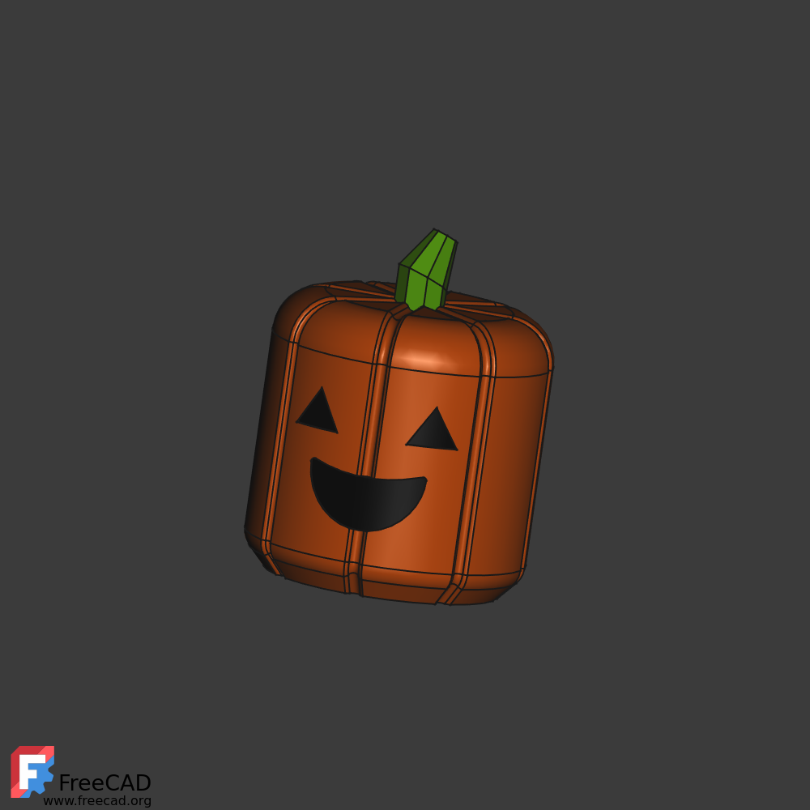

# Pumpkin Head

A pumpkin head for the [Mega Brick Skeleton (10:1
scale)](https://www.printables.com/model/78695-mega-brick-skeleton-101-scale).

### Files

- face-parts.stl
- stem.stl
- pumpkin-head.stl

Print one of each.

### Notes

Depending on printer tolerances, the face might need to be printed at
99.5% for best fit.

Use a glue like E6000 to hold the face parts in.

Print the pumpkin with minimal support, something like 2% crosshatch,
but then use a layer modifier to increase the support percentage for the
top round over. Using lightening is a waste of time and filament. Ask me
how I know.

## Images

